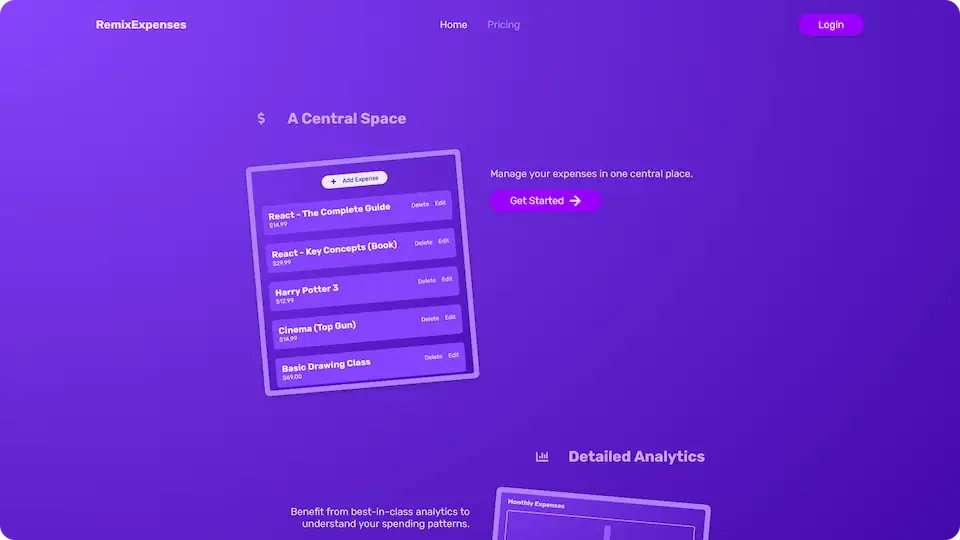

# 💰 Remix Expenses

**Create an account to add, edit, remove and manage expenses with simple analytics.**

## 💻 Screenshot

## 🛠️ Tools and technologies
`Remix` `React` `Prisma` `MongoDB` `TypeScript` `CSS` `VS Code`

## 🌐 Deployment
Deployed on `Vercel`.

Live preview at [saitama-remix-expenses.vercel.app](https://saitama-remix-expenses.vercel.app/).

## 🎓 Related course
This project was created as a part of the [Udemy](https://www.udemy.com/ 'Udemy') course [_Remix.js - The Practical Guide_](https://www.udemy.com/course/remix-course/ 'See this course on Udemy') by [Maximilian Schwarzmüller](https://twitter.com/maxedapps 'Maximilian Schwarzmüller on Twitter').

By preparing this project I learned some **advanced stuff about Remix**.
